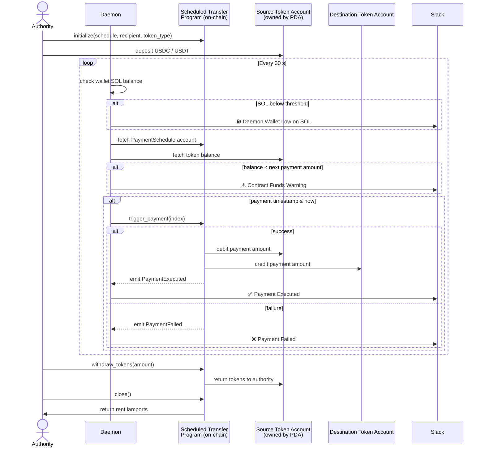

# Scheduled Transfer

A Solana program built with [Anchor](https://www.anchor-lang.com/) that enables
permissionless, time-based SPL token transfers. A payment authority creates a
schedule of future transfers, and any caller can trigger each payment once its
timestamp is reached.

---

## Table of Contents

- [System Overview](#system-overview)
- [Overview](#overview)
- [Program ID](#program-id)
- [Architecture](#architecture)
  - [Accounts](#accounts)
  - [Instructions](#instructions)
    - [initialize](#initialize)
    - [close](#close)
  - [Events](#events)
  - [Errors](#errors)
- [Getting Started](#getting-started)
  - [Prerequisites](#prerequisites)
  - [Build](#build)
  - [Test](#test)
  - [Deploy](#deploy)
- [Usage](#usage)
  - [Initialize a Schedule](#initialize-a-schedule)
  - [Close a Schedule](#close-a-schedule)
  - [Trigger a Payment](#trigger-a-payment)
  - [Check Funds](#check-funds)
  - [Notify Status](#notify-status)
  - [Withdraw Tokens](#withdraw-tokens)
  - [Withdraw SOL](#withdraw-sol)
- [PDAs](#pdas)
- [Security Model](#security-model)

---

## System Overview



---

## Overview

The program lets a token holder pre-authorise a sequence of future transfers to
a fixed recipient. Once deployed, **no privileged key is required to execute
payments** — any wallet can call `trigger_payment` when a payment comes due,
making it suitable for automation via any off-chain cron service or on-chain scheduler.

Key design decisions:

- Payments are stored sorted by timestamp so the "next due" entry is always at
  a predictable position.
- The source token account is owned by the `PaymentSchedule` PDA, so the
  program controls transfers without needing the authority to be online.
- The destination token account is derived on-chain as the recipient's ATA,
  preventing a permissionless caller from redirecting funds.
- `trigger_payment` emits `PaymentFailed` before returning an error, so failed
  attempts are visible on-chain without a separate instruction.
- A `ScheduleCounter` PDA tracks the `schedule_id` per authority, allowing an
  authority to create multiple independent schedules.

---

## Program ID

```text
5BhDb1YqZq8f9yED9rphTobT4zB25cwWWqLaZtYWCJd4
```

---

## Architecture

### Accounts

#### `ScheduleCounter`

A per-authority PDA that tracks how many schedules have been created, providing
a monotonically increasing `schedule_id` used as part of the `PaymentSchedule`
PDA seed.

| Field       | Type     | Description                                   |
| ----------- | -------- | --------------------------------------------- |
| `authority` | `Pubkey` | Wallet that owns this counter                 |
| `next_id`   | `u64`    | The schedule_id that will be used next        |
| `bump`      | `u8`     | PDA bump seed                                 |

**Seeds:** `["schedule_counter", authority]`

---

#### `PaymentSchedule`

The core PDA that stores the transfer configuration and the ordered list of
pending payments.

| Field            | Type                    | Description                              |
| ---------------- | ----------------------- | ---------------------------------------- |
| `authority`      | `Pubkey`                | Wallet that created the schedule         |
| `schedule_id`    | `u64`                   | Unique ID assigned at creation           |
| `recipient`      | `Pubkey`                | Recipient wallet address                 |
| `token_type`     | `TokenType`             | `USDC` or `USDT`                         |
| `schedule`       | `Vec<ScheduledPayment>` | Up to 50 payments, sorted by timestamp   |
| `executed_count` | `u8`                    | Monotonic counter of executed payments   |
| `bump`           | `u8`                    | PDA bump seed                            |

**Seeds:** `["payment_schedule", authority, schedule_id (u64 le bytes)]`

---

### Instructions

#### `initialize`

Creates a `ScheduleCounter` PDA (if not already present) and a new
`PaymentSchedule` PDA using the next available `schedule_id`. The provided
schedule is sorted ascending by timestamp before being stored. Rejects
schedules with more than 50 entries or any payment with a zero amount.

| Argument     | Type                    |
| ------------ | ----------------------- |
| `schedule`   | `Vec<ScheduledPayment>` |
| `recipient`  | `Pubkey`                |
| `token_type` | `TokenType`             |

**Signer:** `authority`

---

#### `close`

Closes the `PaymentSchedule` PDA and returns its rent lamports to the
authority. Can be called at any time — even before all payments have executed.

**Signer:** `authority` (must match the schedule's stored authority)

---

#### `trigger_payment`

Executes the earliest due payment. Transfers tokens from the PDA-owned source
account to the recipient's derived ATA, removes the entry from the schedule,
and emits `PaymentExecuted`.

If the payment cannot be executed (no payment due or insufficient funds), emits
`PaymentFailed` before returning the error — so the failure is recorded on-chain
without requiring a separate instruction.

Fails with:
- `InsufficientFunds` — source balance is below the payment amount.
- `NoPaymentsDue` — no entry has a timestamp ≤ the current clock.

**Permissionless** — any wallet can be the `caller`.

---

#### `check_funds`

Returns an error if the source token account cannot cover the next scheduled
payment. Intended for pre-flight checks by the cron before submitting
`trigger_payment`.

---

#### `check_gas_funds`

Returns an error if the authority's SOL balance is below twice the minimum
rent-exempt threshold.

---

#### `notify_funds_status`

Like `check_funds`, but **always returns `Ok`**. Emits a `FundsWarning` event
when funds are insufficient, so a log subscriber (e.g. Slack bot) can alert the
authority without the cron's heartbeat transaction failing.

---

#### `notify_gas_status`

Like `check_gas_funds`, but **always returns `Ok`**. Emits a `GasFundsWarning`
event when SOL is low.

---

#### `withdraw_tokens`

Transfers SPL tokens from the PDA-owned source token account to any destination
token account. Can be called at any time, whether or not there are pending
payments in the schedule.

| Argument | Type  | Description                 |
| -------- | ----- | --------------------------- |
| `amount` | `u64` | Number of tokens to withdraw |

**Signer:** `authority`

---

#### `withdraw_sol`

Transfers excess SOL lamports from the `PaymentSchedule` PDA to the authority.
Always preserves the rent-exempt minimum — only lamports above that threshold
can be withdrawn.

| Argument | Type  | Description              |
| -------- | ----- | ------------------------ |
| `amount` | `u64` | Lamports to withdraw     |

**Signer:** `authority`

---

### Events

| Event             | Emitted by            | Description                               |
| ----------------- | --------------------- | ----------------------------------------- |
| `PaymentExecuted` | `trigger_payment`     | A transfer completed successfully         |
| `PaymentFailed`   | `trigger_payment`     | A transfer attempt failed                 |
| `FundsWarning`    | `notify_funds_status` | Source balance is below next payment      |
| `GasFundsWarning` | `notify_gas_status`   | Authority SOL is below safe threshold     |
| `TokensWithdrawn` | `withdraw_tokens`     | Authority withdrew SPL tokens from PDA    |
| `SolWithdrawn`    | `withdraw_sol`        | Authority withdrew SOL lamports from PDA  |

---

### Errors

| Code   | Name                   | Description                                      |
| ------ | ---------------------- | ------------------------------------------------ |
| `6000` | `InsufficientFunds`    | Source token balance < next payment amount       |
| `6001` | `InsufficientGasFunds` | Authority SOL < 2× minimum rent                 |
| `6002` | `NoPaymentsScheduled`  | Schedule is empty                                |
| `6003` | `NoPaymentsDue`        | No payment timestamp ≤ current clock             |
| `6004` | `ScheduleTooLarge`     | Schedule exceeds the 50-payment maximum          |
| `6005` | `InvalidPaymentAmount` | A payment amount of zero was provided            |
| `6006` | `InvalidPaymentIndex`  | `payment_index` does not match `executed_count`  |
| `6007` | `ScheduleOverflow`     | Executed payment counter would overflow          |

---

## Getting Started

### Prerequisites

| Tool            | Version   |
| --------------- | --------- |
| Rust            | `1.92.0`  |
| Anchor CLI      | `0.32.1`  |
| Solana CLI      | `≥ 2.3.1` |
| Node / Yarn     | any LTS   |

Install the Rust toolchain (managed automatically via `rust-toolchain.toml`):

```bash
rustup show
```

Install Anchor CLI:

```bash
cargo install --git https://github.com/coral-xyz/anchor anchor-cli --tag v0.32.1
```

### Build

```bash
anchor build
```

The compiled `.so` is written to `target/deploy/scheduled_transfer.so`.

### Test

Tests use [Mollusk SVM](https://github.com/buffalojoec/mollusk) and run without
a local validator:

```bash
cargo test-sbf
```

Or via the Anchor alias:

```bash
anchor test
```

### Deploy

The default cluster in `Anchor.toml` is `localnet` (used for testing). Override
it with `--provider.cluster` to deploy to other networks.

**Devnet**

```bash
anchor build
anchor deploy --provider.cluster devnet
```

**Mainnet**

```bash
anchor build
anchor deploy --provider.cluster mainnet
```

The correct program ID is resolved automatically from the matching
`[programs.<cluster>]` section in `Anchor.toml`.

> Make sure your wallet (`~/.config/solana/id.json`) is funded on the target
> network before deploying.

---

## Usage

### Initialize a Schedule

```typescript
await program.methods
  .initialize(
    [
      { timestamp: new BN(Date.now() / 1000 + 3600), amount: new BN(100_000) },
      { timestamp: new BN(Date.now() / 1000 + 7200), amount: new BN(200_000) },
    ],
    recipient,
    { usdc: {} }
  )
  .accounts({ authority: wallet.publicKey })
  .rpc();
```

### Close a Schedule

```typescript
await program.methods
  .close()
  .accounts({ authority: wallet.publicKey })
  .rpc();
```

### Trigger a Payment

The destination token account is validated on-chain as the recipient's ATA —
compute it client-side and pass it as the `destinationTokenAccount` account.

```typescript
await program.methods
  .triggerPayment(0) // payment_index
  .accounts({
    paymentSchedule: schedPda,
    sourceTokenAccount: sourceTa,
    destinationTokenAccount: recipientAta,
    caller: wallet.publicKey,
  })
  .rpc();
```

### Check Funds

```typescript
await program.methods
  .checkFunds()
  .accounts({ paymentSchedule: schedPda, sourceTokenAccount: sourceTa })
  .rpc();
```

### Notify Status

These are fire-and-forget heartbeat calls safe to include in every cron tick:

```typescript
await program.methods
  .notifyFundsStatus()
  .accounts({ paymentSchedule: schedPda, sourceTokenAccount: sourceTa })
  .rpc();

await program.methods
  .notifyGasStatus()
  .accounts({ authority: authorityPubkey })
  .rpc();
```

### Withdraw Tokens

Reclaim USDC or USDT from the PDA-owned source token account:

```typescript
await program.methods
  .withdrawTokens(new BN(500_000))
  .accounts({
    paymentSchedule: schedPda,
    sourceTokenAccount: sourceTa,
    destinationTokenAccount: authorityTa,
    authority: wallet.publicKey,
  })
  .rpc();
```

### Withdraw SOL

Reclaim excess SOL lamports from the `PaymentSchedule` PDA:

```typescript
await program.methods
  .withdrawSol(new BN(1_000_000)) // lamports
  .accounts({
    paymentSchedule: schedPda,
    authority: wallet.publicKey,
  })
  .rpc();
```

---

## PDAs

```text
ScheduleCounter:
  seeds = ["schedule_counter", authority]

PaymentSchedule:
  seeds = ["payment_schedule", authority, schedule_id (u64, little-endian)]
```

---

## Security Model

See [SECURITY.md](./SECURITY.md) for a full description of the threat model,
account and instruction security properties, arithmetic safety, CPI safety, and
known design tradeoffs.
